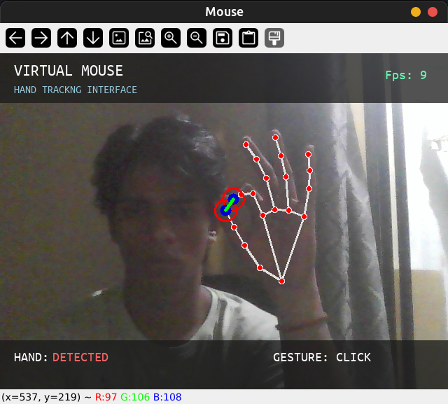

# Air Mouse - Control ur cursor using hand gestures

<p align="center">
  
  
  
  
  
</p>

---

## Preview



---

### Features  
- Real-time hand tracking using mediapipe
- Cursor control with your index finger
- Pinch gesture for left-clicking
- Smooth cursor movement with interpolation
- Real-time FPS counter
- Live webcam preview

---

## Controls  
| Gesture | Action |
|:--|:--|
| Move your index finger | Move cursor |
| Pinch using index finger and thumb | Left click |
| ESC | Exit application |

---

## Installation
``` bash
git clone https://github.com/puneet-zsh/air-mouse.git
cd air-mouse
```

## Create virtual environment
`python -m venv .venv `

## Activate environment
<details> <summary> <b> Linux / MacOS </b> </summary>

`source .venv/bin/activate`

</details>
<details> <summary> <b> Windows </b> </summary>

`.venv/script/activate`
</details>

## Install dependencies
`pip install -r requirements.txt`

---

## Build with
- python
- Open-CV
- Mediapipe
- PyAutoGUI
- NumPy
- Pillow

---

## Settings
> [!Note]  
> You can adjust these values inside mouse.py  
> DPI = 3 ` It controls cursor smoothing`  
> Click_distance = 20 ` It controls pinch sensitivity`  

---

## Project Structure

```
air-mouse/
├── mouse.py
├── font.ttf
├── requirements.txt
├── README.md
└── assets/
    └── demo.png
```

---

## Requirements
- Python 3.x
- A working webcam
